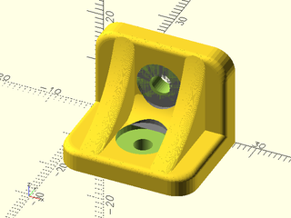
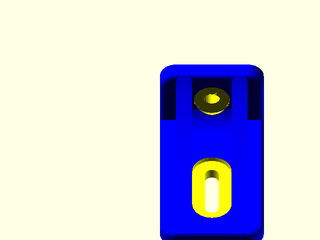

# LibFile: unfy\_brackets.scad

UnfyOpenSCADLib Copyright Leif Burrow 2026
kc8rwr@unfy.us
unforgettability.net

This file is part of UnfyOpenSCADLib.

UnfyOpenSCADLib is free software: you can redistribute it and/or modify it under the terms of the
GNU General Public License as published by the Free Software Foundation, either version 3 of
the License, or (at your option) any later version.

UnfyOpenSCADLib is distributed in the hope that it will be useful, but WITHOUT ANY WARRANTY;
without even the implied warranty of MERCHANTABILITY or FITNESS FOR A PARTICULAR PURPOSE.
See the GNU General Public License for more details.

You should have received a copy of the GNU General Public License along with UnfyOpenSCADLib.
If not, see <https://www.gnu.org/licenses/>.

## File Contents

- [`unf_simple_bracket`](#module-unf_simple_bracket)

### Module: unf\_simple\_bracket

**Usage:** 

- unf_simple_bracket(&lt;args&gt;);

**Description:** 

Creates a simple bracket.

**Arguments:** 

<abbr title="These args can be used by position or by name.">By&nbsp;Position</abbr> | What it does
-------------------- | ------------
`top_bolt_size`      | bolt size for top side of bracket (M4)
`top_slot_length`    | setting a length here allows the top mounting hole to be a slot, allowing adjustment rather than a plain round hole (0)
`top_bolt_position`  | vertical location of the top mounting hole, distance from the bend (11)
`bottom_bolt_size`   | bolt size for bottom side of bracket (#6)
`bottom_slot_length` | setting a length here allows the bottom mounting hole to be a slot, allowing adjustment rather than a plain round hole (0)
`bottom_bolt_position` | horizontal location of the bottom mounting hole, distance from the bend (11)
`body_color`         | color of the bracket or false for default (false)
`wall`               | width of both sides of the bracket (4)

**Figure 1.1.1:** defaults

 

**Figure 1.1.2:** bottom\_bolt\_position=22, bottom\_slot\_length=15

 

---

