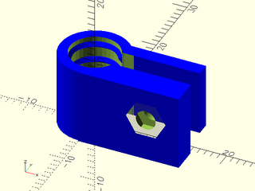
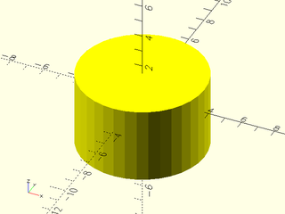
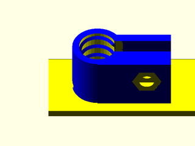
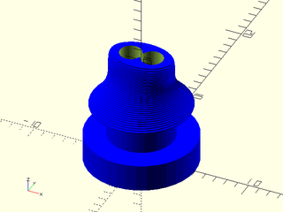
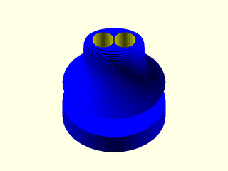

# LibFile: unfy\_cablemanagement.scad

UnfyOpenSCADLib Copyright Leif Burrow 2026
kc8rwr@unfy.us
unforgettability.net

This file is part of UnfyOpenSCADLib.

UnfyOpenSCADLib is free software: you can redistribute it and/or modify it under the terms of the
GNU General Public License as published by the Free Software Foundation, either version 3 of
the License, or (at your option) any later version.

UnfyOpenSCADLib is distributed in the hope that it will be useful, but WITHOUT ANY WARRANTY;
without even the implied warranty of MERCHANTABILITY or FITNESS FOR A PARTICULAR PURPOSE.
See the GNU General Public License for more details.

You should have received a copy of the GNU General Public License along with UnfyOpenSCADLib.
If not, see <https://www.gnu.org/licenses/>.

## File Contents

- [`unf_cableClip_positive`](#module-unf_cableclip_positive)
- [`unf_cableClip_Negative`](#module-unf_cableclip_negative)
- [`unf_cableClip`](#module-unf_cableclip)
- [`unf_clipInStrainRelief`](#module-unf_clipinstrainrelief)

### Module: unf\_cableClip\_positive

**Usage:** 

- unf_cableClip_positive(&lt;args&gt;);

**Description:** 

Just the positive part of a cable clip.

**Arguments:** 

<abbr title="These args can be used by position or by name.">By&nbsp;Position</abbr> | What it does
-------------------- | ------------
`cable_d`            | cable diameter (7.5)
`gap`                | width of the gap in the circle, which gets pinched shut to squeeze the cable (3)
`bolt`               | bolt size for closing the clip (M3)
`tooth_length`       | optional teeth to grip the cable, this is how far they stick inward (0.5)
`tooth_count`        | how many teeth (4)
`wall`               | minimum thickness of parts (1.4)
`support`            | Optional support for printing, may be vertical, horizontal or none (none)
`support_skin`       | thickness of support skin, if generating supports, probably good to use the minimum your slicer will include (0.6)
`body_color`         | color of the generated part or false for default (blue)
`support_color`      | color of generated supports or false for default (yellow)
`center`             | center the part (true)

**Figure 1.1.1:** 

  

---

### Module: unf\_cableClip\_Negative

**Usage:** 

- unf_cableClip_Negative(&lt;args&gt;);

**Description:** 

Just the negative part of a cable clip. Really, this is just a cylinder to extend the cable hole into the object the clip attaches to.
What is useful here is that if rendered in the same location as the positive part it will locate the hole in the correct place.

**Arguments:** 

<abbr title="These args can be used by position or by name.">By&nbsp;Position</abbr> | What it does
-------------------- | ------------
`cable_d`            | cable diameter (7.5)
`bolt`               | bolt size for closing the clip (M3)
`wall`               | minimum thickness of parts (1.4)
`hole_ext`           | how far to extend the cable hole in (3)
`center`             | center the part (true)

**Figure 1.2.1:** 

  

---

### Module: unf\_cableClip

**Usage:** 

- unf_cableClip(&lt;args&gt;){ &nbsp;&nbsp;&nbsp;child_stuff(); }

**Description:** 

Operator module that uses unf_cableClip_Positive() and unf_cableClip_Negative() to place a cable clip on and a cable hole through the child object(s).

**Arguments:** 

<abbr title="These args can be used by position or by name.">By&nbsp;Position</abbr> | What it does
-------------------- | ------------
`location`           | where to place the clip relative to the child/childrens' origin. ([0, 0, 0])
`rotation`           | how to orientate the clip releative to the child/childen objects (0)
`cable_d`            | cable diameter (7.5)
`bolt`               | bolt size for closing the clip (M3)
`gap`                | width of the gap in the circle, which gets pinched shut to squeeze the cable (3)
`hole_ext`           | how far to extend the cable hole into the child/children (3)
`tooth_length`       | optional teeth to grip the cable, this is how far they stick inward (0.5)
`tooth_count`        | how many teeth (4)
`support`            | optional support for printing, may be vertical, horizontal or none (none)
`support_skin`       | thickness of support skin, if generating supports, probably good to use the minimum your slicer will include (0.6)
`wall`               | minimum thickness of parts (1.4)
`body_color`         | color of the generated part or false for default (blue)
`support_color`      | color of generated supports or false for default (yellow)
`center`             | center the part (true)

**Figure 1.3.1:** 

  

---

### Module: unf\_clipInStrainRelief

**Usage:** 

- unf_clipInStrainRelief(&lt;args&gt;);

**Description:** 

A cable strain relief that can be closed within a hole between two walls of a chassis.

**Arguments:** 

<abbr title="These args can be used by position or by name.">By&nbsp;Position</abbr> | What it does
-------------------- | ------------
`cable_d`            | cable diameter (2.5)
`num_conductors`     | number of conductors or separate cables to pass through (2)
`inside_diameter`    | diameter of non-tapered end that goes inside the chasis (12)
`inside_length`      | length of non-tapered end that goes inside the chasis (2.5)
`waste_diameter`     | diameter of narrow part that gets gripped by the chassis (6)
`waste_length`       | length of the narrow part that gets gripped by the chassis (3)
`outside_length`     | length of the tapered end that goes outside the chasis (7)
`outside_diameter`   | diameter of the tapered end that goes outside the chasis (12)
`wall`               | minimum wall thickness (1.5)
`body_color`         | color of the generated part or false for default (blue)
`support_skin`       | thickness of support skin to print along the outside edge of the waste for preventing overhang (0.6)
`support_color`      | color of generated supports or false for default (yellow)
`edge_r`             | radius of rounded edges (2)

**Figure 1.4.1:** 

 

**Figure 1.4.2:** 

  

---

