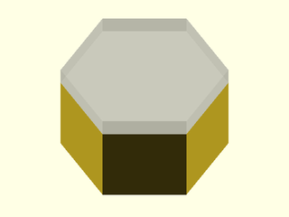

# LibFile: unfy\_fasteners.scad

UnfyOpenSCADLib Copyright Leif Burrow 2026
kc8rwr@unfy.us
unforgettability.net

This file is part of UnfyOpenSCADLib.

Unfy_fasteners.scad contains modules for creating bolts, screws, nuts, washers, heatsink inserts and more. These models at the time do not include threads. Their purpose is for subtracting from a model to create holes and countersinks. Realistic models with threads could be added later if there is a use for them.

Fasteners may be generated to size by passing the size as a string. Metric sizes may be passed as "M&lt;number&gt;" such as "M4" or "M3". It is case insensitie so "m4" or "m3" will work as well. Numbered SAE sizes are represented as "#&lt;number&gt;", such as "#6" or "#8". Inch sizes are represented as a decimal number or as a fraction. "1/4" or "0.25" would both represent 1/4".

Tables are included for looking up dimensions based on these sizes. Shaft diameter of course is the size itself in it's respective units. Tables also include things like typical diameters and thicknesses of heads for various bolt types, nut, washer and heatset insert dimensions, etc... Most sizes commonly used in 3d-printed projects as well as larger fasteners commonly available in hardware stores are included. If sizes that are outside of the built in tables are requested then the code will attempt to interpolate the missing value.

Functions are included to look up the various dimensions of fasteners by size and type. This way one using this library may allow the end user to choose fastener sizes from the customizer menu. Then the script may adapt, re-sizing or re-positioning things based on the outer dimensions of the requested fastener sizes. Sizes may be looked up as scalars describing just one dimension. Or they may be looked up as a vector which may then be passed to the functions that look up the individual dimensions or the module which renders the part. This way the lookup and/or interpolation need only happen once.

The goal here is to allow the user to create customizable designs where the end user may choose parts that they already have on hand or parts that are easily available. Designers are encouraged to give the end-user plenty of choices. Perfectly valid arguments regarding the merits of measurement systems aside, the best fastener size is the one you already have on hand. The next best is the one your local hardware store sells in bulk rather than the specialty isle.

Provisions are included for distorting horizontal bolt holes, to remove some extra material from the top side. This way when printing via fused filament fabrication plastic which sags down will just cancel this distortion out rather than requiring drilling so the bolt can fit cleanly. The distortion is defined by two special variables, $unf-hdist_y and $unf_hdist_x. These define the extra removed material by height and width respectively, both as a percentage of the shaft diameter.

So far this feature has been developed only for bolt holes and not the other parts. The original intention was to distort every part depending on the angle at which it is rendered. Unfortunately there is no good way to know what angle a part is being rendered in OpenSCAD so it relies on the user telling it. Thus this feature has not been furtner developed.

## File Contents

- [`unf_fnr_type`](#function-unf_fnr_type) – Fastener Type
- [`unf_fnr_size`](#function-unf_fnr_size) – Fastener Size
- [`unf_fnr_diameter`](#function-unf_fnr_diameter) – Fastener Clearance Diameter
- [`unf_fnr_shaft_diameter`](#function-unf_fnr_shaft_diameter) – Fastener Shaft Diameter
- [`unf_shaft`](#module-unf_shaft) – Fastener Shaft

2. [Section: Cap Bolts - unf\_cap\_*](#section-cap-bolts---unf_cap_)
    - [`unf_cap_v`](#function-unf_cap_v) – Cap Head Bolt Vector
    - [`unf_cap_head_diameter`](#function-unf_cap_head_diameter) – Cap Head Bolt Clearance Diameter
    - [`unf_cap_head_height`](#function-unf_cap_head_height) – Cap Head Bolt Head Height
    - [`unf_cap_default_length`](#function-unf_cap_default_length) – Cap Head Bolt Default Length
    - [`unf_cap`](#module-unf_cap) – Cap Head Bolt

3. [Section: Countersunk Bolts - unf\_csk\_*](#section-countersunk-bolts---unf_csk_)
    - [`unf_csk_v`](#function-unf_csk_v) – Counter Sunk Bolt Vector
    - [`unf_csk_head_diameter`](#function-unf_csk_head_diameter) – Countersunk Head Clearance Diameter
    - [`unf_csk_head_height`](#function-unf_csk_head_height) – Countersunk Head Height
    - [`unf_csk_default_length`](#function-unf_csk_default_length) – Countersunk Bolt Default Length
    - [`unf_csk`](#module-unf_csk) – Countersunk Bolt

4. [Section: Hex Head Bolts - unf\_hex\_*](#section-hex-head-bolts---unf_hex_)
    - [`unf_hex_v`](#function-unf_hex_v) – Hex Head Bolt Vector
    - [`unf_hex_head_diameter`](#function-unf_hex_head_diameter) – Hex Head Bolt Clearance Diameter
    - [`unf_hex_head_height`](#function-unf_hex_head_height) – Hex Head Height
    - [`unf_hex_default_length`](#function-unf_hex_default_length) – Hex Head Bolt Default Length
    - [`unf_hex`](#module-unf_hex) – Hex Head Bolt

5. [Section: Heatset Inserts - unf\_hst\_*](#section-heatset-inserts---unf_hst_)
    - [`unf_hst_v`](#function-unf_hst_v) – Heatset Insert Vector
    - [`unf_hst_diameter`](#function-unf_hst_diameter) – Heatset Insert Diameter
    - [`unf_hst_height`](#function-unf_hst_height) – Heatset Insert Height
    - [`unf_hst`](#module-unf_hst) – Heatset Insert

6. [Section: Hex Nut - unf\_nut\_*](#section-hex-nut---unf_nut_)
    - [`unf_nut_v`](#function-unf_nut_v) – hex-nut vector
    - [`unf_nut_diameter`](#function-unf_nut_diameter) – Hex Nut Clearance Diameter
    - [`unf_nut_height`](#function-unf_nut_height) – Hex Nut Height
    - [`unf_nut`](#module-unf_nut) – Hex Nut

7. [Section: Square Nut - unf\_sqr\_*](#section-square-nut---unf_sqr_)
    - [`unf_sqr_v`](#function-unf_sqr_v) – Square Nut Vector
    - [`unf_sqr_length`](#function-unf_sqr_length) – Square Nut Side Length
    - [`unf_sqr_height`](#function-unf_sqr_height) – Square Nut Height / Thickness
    - [`unf_sqr`](#module-unf_sqr) – Square Nut

8. [Section: Licensing](#section-licensing)

### Function: unf\_fnr\_type

**Synopsis:** Fastener Type

**Usage:** 

- unf_fnr_type(fastener_vector)

**Description:** 

Takes a vector describing a fastener and returns a string representing the fastener type.

**Arguments:** 

<abbr title="These args can be used by position or by name.">By&nbsp;Position</abbr> | What it does
-------------------- | ------------
`in`                 | vector describing an unfy_fastener

---

### Function: unf\_fnr\_size

**Synopsis:** Fastener Size

**Usage:** 

- unf_fnr_size(fastener_size_or_vector)

**Description:** 

Takes a vector describing a fastener or a string representing the fastener size and returns a string representing the fastener size.

Of course this isnt't doing much when it is passed the string. This is done so that a variable may hold the size string which the user requested before it is expanded into the vector and still work in the same code.

**Arguments:** 

<abbr title="These args can be used by position or by name.">By&nbsp;Position</abbr> | What it does
-------------------- | ------------
`in`                 | vector describing an unfy_fastener or a string representing the size of one.

---

### Function: unf\_fnr\_diameter

**Synopsis:** Fastener Clearance Diameter

**Usage:** 

- unf_fnr_diameter(fastener_size_or_vector)

**Description:** 

Takes a vector describing a fastener or a string representing the fastener size and returns the diameter of the widest part in millimeters. Useful for calculating positioning or sizes of parts that will contain the fastener when the end-user is allowed to pick from a variety of sizes of fasteners.

**Arguments:** 

<abbr title="These args can be used by position or by name.">By&nbsp;Position</abbr> | What it does
-------------------- | ------------
`in`                 | vector describing an unfy_fastener or a string representing the size of one.

---

### Function: unf\_fnr\_shaft\_diameter

**Synopsis:** Fastener Shaft Diameter

**Usage:** 

- unf_fnr_shaft_diameter(fastener_size_or_vector)

**Description:** 

Takes a vector describing a fastener or a string representing the fastener size and returns the shaft diameter in millimeters.

**Arguments:** 

<abbr title="These args can be used by position or by name.">By&nbsp;Position</abbr> | What it does
-------------------- | ------------
`in`                 | vector describing an unfy_fastener or a string representing the size of one.

---

### Module: unf\_shaft

**Synopsis:** Fastener Shaft

**Usage:** 

- unf_shaft(diameter, length, distorted, $unf_hdist_x, $unf_hdist_y)

**Description:** 

Render a fastener shaft hole, optionally with distortions to account for overhang sagging when 3d-printing.

**Figure 1.5.1:** various values of unf\_hdist\_x and unf\_hdist\_y. (0, 0) or distorted=false would be a perfect circle.

 

**Arguments:** 

<abbr title="These args can be used by position or by name.">By&nbsp;Position</abbr> | What it does
-------------------- | ------------
`diameter`           | shaft diameter in mm
`length`             | length in mm
`distorted`          | true/false should this be distorted

<abbr title="These args must be used by name, ie: name=value">By&nbsp;Name</abbr> | What it does
-------------------- | ------------
`$unf_hdist_x`       | width of distortion as a percentage of the diameter (0-100)
`$unf_hdist_y`       | height of distortion as a percentage of the diameter (0-100)

---

## Section: Cap Bolts - unf\_cap\_*

The vector representing a cap bolt will consist of, in order:
* name
* bolt_diameter
* head_diameter
* head_height
* default_length

### Function: unf\_cap\_v

**Synopsis:** Cap Head Bolt Vector

**Usage:** 

- unf_cap_v(size_or_vector)

**Description:** 

Retrieve a vector representing the dimensions of a cap-head bolt given the size. Will return the passed parameter if passed a vector. Thus sizes and dimension vectors may be treated interchangably.

**Arguments:** 

<abbr title="These args can be used by position or by name.">By&nbsp;Position</abbr> | What it does
-------------------- | ------------
`size`               | size as a string or the vector itself

---

### Function: unf\_cap\_head\_diameter

**Synopsis:** Cap Head Bolt Clearance Diameter

**Usage:** 

- unf_cap_head_diameter(size_or_vector)

**Description:** 

Retrieve the diameter in mm of the head of a cap-head bolt given the size.

**Arguments:** 

<abbr title="These args can be used by position or by name.">By&nbsp;Position</abbr> | What it does
-------------------- | ------------
`size`               | size as a string or the unf_cap_v() vector itself

---

### Function: unf\_cap\_head\_height

**Synopsis:** Cap Head Bolt Head Height

**Usage:** 

- unf_cap_head_height(size_or_vector)

**Description:** 

Retrieve the height or thickness in mm of the head of a cap-head bolt given the size.

**Arguments:** 

<abbr title="These args can be used by position or by name.">By&nbsp;Position</abbr> | What it does
-------------------- | ------------
`size`               | size as a string or the unf_cap_v() vector itself

---

### Function: unf\_cap\_default\_length

**Synopsis:** Cap Head Bolt Default Length

**Usage:** 

- unf_cap_default_length(size_or_vector)

**Description:** 

Retrieve a default length for a cap head bolt given it's size. Probably not very useful in a real design, good for picking a length to demonstrate an example of a unf_cap bolt.

**Arguments:** 

<abbr title="These args can be used by position or by name.">By&nbsp;Position</abbr> | What it does
-------------------- | ------------
`size`               | size as a string or the unf_cap_v() vector itself

---

### Module: unf\_cap

**Synopsis:** Cap Head Bolt

**Usage:** 

- unf_cap(size, length, head_ext, distorted, $unf_hdist_x, $unf_hdist_y)

**Description:** 

Render a negative for a shaft and/or head-recess for a cap-head bolt. Note, the cap head is rendered as a simple cylinder with the diameter of the widest part of the actual head. This is because it is meant for being a negative, to recess a bolt and not for printing an actual bolt.

**Figure 2.5.1:** note - the head\_ext area is semi-transparent.

  

**Arguments:** 

<abbr title="These args can be used by position or by name.">By&nbsp;Position</abbr> | What it does
-------------------- | ------------
`size`               | string representing the size or the unf_cap_v() vector.
`length`             | length in mm
`head_ext`           | length in mm to recess the head beyond just it's thickness
`distorted`          | true/false, should the bolt hole be distorted

<abbr title="These args must be used by name, ie: name=value">By&nbsp;Name</abbr> | What it does
-------------------- | ------------
`$unf_hdist_x`       | width of distortion as a percentage of the diameter (0-100)
`$unf_hdist_y`       | height of distortion as a percentage of the diameter (0-100)

---

## Section: Countersunk Bolts - unf\_csk\_*

The vector representing a countersunk bolt will consist of, in order:
* name
* bolt_diameter
* head_diameter
* head_height
* default_length

### Function: unf\_csk\_v

**Synopsis:** Counter Sunk Bolt Vector

**Usage:** 

- unf_csk_v(size_or_vector)

**Description:** 

Retrieve a vector representing the dimensions of a countersunk bolt given the size. Will return the passed parameter if passed a vector. Thus sizes and dimension vectors may be treated interchangably.

**Arguments:** 

<abbr title="These args can be used by position or by name.">By&nbsp;Position</abbr> | What it does
-------------------- | ------------
`size`               | size as a string or the vector itself

---

### Function: unf\_csk\_head\_diameter

**Synopsis:** Countersunk Head Clearance Diameter

**Usage:** 

- unf_csk_head_diameter(size_or_vector)

**Description:** 

Retrieve the diameter in mm of the head of a countersunk bolt given the size.

**Arguments:** 

<abbr title="These args can be used by position or by name.">By&nbsp;Position</abbr> | What it does
-------------------- | ------------
`size`               | size as a string or the unf_csk_v() vector itself

---

### Function: unf\_csk\_head\_height

**Synopsis:** Countersunk Head Height

**Usage:** 

- unf_csk_head_height(size_or_vector)

**Description:** 

Retrieve the height or thickness in mm of the head of a countersunk bolt given the size.

**Arguments:** 

<abbr title="These args can be used by position or by name.">By&nbsp;Position</abbr> | What it does
-------------------- | ------------
`size`               | size as a string or the unf_cap_v() vector itself

---

### Function: unf\_csk\_default\_length

**Synopsis:** Countersunk Bolt Default Length

**Usage:** 

- unf_csk_default_length(size_or_vector)

**Description:** 

Retrieve a default length for a countersunk bolt given it's size. Probably not very useful in a real design, good for picking a length to demonstrate an example of a unf_csk bolt.

**Arguments:** 

<abbr title="These args can be used by position or by name.">By&nbsp;Position</abbr> | What it does
-------------------- | ------------
`size`               | size as a string or the unf_cap_v() vector itself

---

### Module: unf\_csk

**Synopsis:** Countersunk Bolt

**Usage:** 

- unf_csk(size, length, head_ext, distorted, $unf_hdist_x, $unf_hdist_y)

**Description:** 

Render a negative for a shaft and/or head-recess for a cap-head bolt. Note, the cap head is rendered as a simple cylinder with the diameter of the widest part of the actual head. This is because it is meant for being a negative, to recess a bolt and not for printing an actual bolt.

**Figure 3.5.1:** note - the head\_ext area is semi-transparent.

  

**Arguments:** 

<abbr title="These args can be used by position or by name.">By&nbsp;Position</abbr> | What it does
-------------------- | ------------
`size`               | string representing the size or the unf_cap_v() vector.
`length`             | length in mm
`head_ext`           | length in mm to recess the head beyond just it's thickness
`distorted`          | true/false, should the bolt hole be distorted

<abbr title="These args must be used by name, ie: name=value">By&nbsp;Name</abbr> | What it does
-------------------- | ------------
`$unf_hdist_x`       | width of distortion as a percentage of the diameter (0-100)
`$unf_hdist_y`       | height of distortion as a percentage of the diameter (0-100)

---

## Section: Hex Head Bolts - unf\_hex\_*

The vector representing a hex head bolt will consist of, in order:
* name
* bolt_diameter
* head_diameter
* head_height
* default_length

### Function: unf\_hex\_v

**Synopsis:** Hex Head Bolt Vector

**Usage:** 

- unf_hex_v(size_or_vector)

**Description:** 

Retrieve a vector representing the dimensions of a hex-head bolt given the size. Will return the passed parameter if passed a vector. Thus sizes and dimension vectors may be treated interchangably.

**Arguments:** 

<abbr title="These args can be used by position or by name.">By&nbsp;Position</abbr> | What it does
-------------------- | ------------
`size`               | size as a string or the vector itself

---

### Function: unf\_hex\_head\_diameter

**Synopsis:** Hex Head Bolt Clearance Diameter

**Usage:** 

- unf_hex_head_diameter(size_or_vector)

**Description:** 

Retrieve the diameter in mm of the head of a hex-head bolt given the size.

**Arguments:** 

<abbr title="These args can be used by position or by name.">By&nbsp;Position</abbr> | What it does
-------------------- | ------------
`size`               | size as a string or the unf_hex_v() vector itself

---

### Function: unf\_hex\_head\_height

**Synopsis:** Hex Head Height

**Usage:** 

- unf_hex_head_height(size_or_vector)

**Description:** 

Retrieve the height or thickness in mm of the head of a hex-head bolt given the size.

**Arguments:** 

<abbr title="These args can be used by position or by name.">By&nbsp;Position</abbr> | What it does
-------------------- | ------------
`size`               | size as a string or the unf_hex_v() vector itself

---

### Function: unf\_hex\_default\_length

**Synopsis:** Hex Head Bolt Default Length

**Usage:** 

- unf_hex_default_length(size_or_vector)

**Description:** 

Retrieve a default length for a hex head bolt given it's size. Probably not very useful in a real design, good for picking a length to demonstrate an example of a unf_hrx bolt.

**Arguments:** 

<abbr title="These args can be used by position or by name.">By&nbsp;Position</abbr> | What it does
-------------------- | ------------
`size`               | size as a string or the unf_hex_v() vector itself

---

### Module: unf\_hex

**Synopsis:** Hex Head Bolt

**Usage:** 

- unf_hex(size, length, head_ext, distorted, $unf_hdist_x, $unf_hdist_y)

**Description:** 

Render a negative for a shaft and/or head-recess for a hex-head bolt.

**Figure 4.5.1:** note - the head\_ext area is semi-transparent.

  

**Arguments:** 

<abbr title="These args can be used by position or by name.">By&nbsp;Position</abbr> | What it does
-------------------- | ------------
`size`               | string representing the size or the unf_hex_v() vector.
`length`             | length in mm
`head_ext`           | length in mm to recess the head beyond just it's thickness
`distorted`          | true/false, should the bolt hole be distorted

<abbr title="These args must be used by name, ie: name=value">By&nbsp;Name</abbr> | What it does
-------------------- | ------------
`$unf_hdist_x`       | width of distortion as a percentage of the diameter (0-100)
`$unf_hdist_y`       | height of distortion as a percentage of the diameter (0-100)

---

## Section: Heatset Inserts - unf\_hst\_*

The vector representing a heatset insert will contain, in order:
* name
* shaft_diameter
* insert_diameter
* length

note - these are pilot hole dimensions, not dimensions of the actual insert

### Function: unf\_hst\_v

**Synopsis:** Heatset Insert Vector

**Usage:** 

- unf_hst_v(size_or_vector)

**Description:** 

Retrieve a vector representing the dimensions of a heatset insert given the size. Will return the passed parameter if passed a vector. Thus sizes and dimension vectors may be treated interchangably.

**Arguments:** 

<abbr title="These args can be used by position or by name.">By&nbsp;Position</abbr> | What it does
-------------------- | ------------
`size`               | size as a string or the vector itself

---

### Function: unf\_hst\_diameter

**Synopsis:** Heatset Insert Diameter

**Usage:** 

- unf_hst_diameter(size_or_vector)

**Description:** 

Retrieve the diameter in mm of the hole for a heatset insert given the size.

**Arguments:** 

<abbr title="These args can be used by position or by name.">By&nbsp;Position</abbr> | What it does
-------------------- | ------------
`size`               | size as a string or the unf_hst_v() vector itself

---

### Function: unf\_hst\_height

**Synopsis:** Heatset Insert Height

**Usage:** 

- unf_hst_height(size_or_vector)

**Description:** 

Retrieve the length in mm of the hole for a heatset insert given the size.

**Arguments:** 

<abbr title="These args can be used by position or by name.">By&nbsp;Position</abbr> | What it does
-------------------- | ------------
`size`               | size as a string or the unf_hst_v() vector itself

---

### Module: unf\_hst

**Synopsis:** Heatset Insert

**Usage:** 

- unf_hst(size, opening_taper_percent, length, head_ext, extra_room, bolt_hole_depth)

**Description:** 

Render a negative for a heatset-insert hole.

**Figure 5.4.1:** note - the head\_ext area is semi-transparent.

 

**Arguments:** 

<abbr title="These args can be used by position or by name.">By&nbsp;Position</abbr> | What it does
-------------------- | ------------
`size`               | string representing the size or the unf_cap_v() vector.
`opening_taper_percent` | enlarge the opening with a taper for ease of insertion.
`length`             | Heatset inserts for the same bolt size do come in a variety of lenghts. Fortunately, because when using them one is melting into the plastic it is not necessary to be 100% accurate. For this field use one of small, medium or large to get holes for smaller to larger heatset inserts respectively.
`head_ext`           | length in mm to recess the head beyond just it's thickness
`extra_room`         | Continue the hole, at the inserts outer dimension a bit farther into the part. This creates a space for molten plastic to flow to when inserting the insert.
`bolt_hole_depth`    | Extend the hole at the width of the bolt, not the width of the insert beyond the insert to make room for the bolt to pass through the insert and deeper into the hole.

---

## Section: Hex Nut - unf\_nut\_*

The vector representing a hex nut will contain, in order:
* name
* nut_diameter
* height

### Function: unf\_nut\_v

**Synopsis:** hex-nut vector

**Usage:** 

- unf_nut_v(size_or_vector)

**Description:** 

Retrieve a vector representing the dimensions of a hex-nut bolt given the size. Will return the passed parameter if passed a vector. Thus sizes and dimension vectors may be treated interchangably.

**Arguments:** 

<abbr title="These args can be used by position or by name.">By&nbsp;Position</abbr> | What it does
-------------------- | ------------
`size`               | size as a string or the vector itself

---

### Function: unf\_nut\_diameter

**Synopsis:** Hex Nut Clearance Diameter

**Usage:** 

- unf_nut_diameter(size)

**Description:** 

Takes a fastener size or a hex nut vector and returns the clearance diameter

---

### Function: unf\_nut\_height

**Synopsis:** Hex Nut Height

**Usage:** 

- unf_nut_height(size_or_vector)

**Description:** 

Retrieve the height (thickness) of a typical hex nut given the bolt size.

**Arguments:** 

<abbr title="These args can be used by position or by name.">By&nbsp;Position</abbr> | What it does
-------------------- | ------------
`size`               | size as a string or the unf_nut_v() vector itself

---

### Module: unf\_nut

**Synopsis:** Hex Nut

**Usage:** 

- unf_nut(size, ext)

**Description:** 

Render a negative for a hex nut hole.

**Figure 6.4.1:** note - the ext area is semi-transparent.

  

**Arguments:** 

<abbr title="These args can be used by position or by name.">By&nbsp;Position</abbr> | What it does
-------------------- | ------------
`size`               | string representing the size or the unf_nut_v() vector.
`ext`                | length in mm to recess the nut beyond just it's thickness

---

## Section: Square Nut - unf\_sqr\_*

The vector representing a square nut shall contain, in order:
* name
* side_length
* height

### Function: unf\_sqr\_v

**Synopsis:** Square Nut Vector

**Usage:** 

- unf_sqr_v(size_or_vector)

**Description:** 

Retrieve a vector representing the dimensions of a square nut given the size. Will return the passed parameter if passed a vector. Thus sizes and dimension vectors may be treated interchangably.

**Arguments:** 

<abbr title="These args can be used by position or by name.">By&nbsp;Position</abbr> | What it does
-------------------- | ------------
`size`               | size as a string or the vector itself

---

### Function: unf\_sqr\_length

**Synopsis:** Square Nut Side Length

**Usage:** 

- unf_sqr_length(size_or_vector)

**Description:** 

Retrieve the length of a side of a square nut.

**Arguments:** 

<abbr title="These args can be used by position or by name.">By&nbsp;Position</abbr> | What it does
-------------------- | ------------
`size`               | size as a string or the unf_cap_v() vector itself

---

### Function: unf\_sqr\_height

**Synopsis:** Square Nut Height / Thickness

**Usage:** 

- unf_sqr_height(size_or_vector)

**Description:** 

Retrieve the thickness of a square nut, it's height when lying flat.

**Arguments:** 

<abbr title="These args can be used by position or by name.">By&nbsp;Position</abbr> | What it does
-------------------- | ------------
`size`               | size as a string or the unf_cap_v() vector itself

---

### Module: unf\_sqr

**Synopsis:** Square Nut

**Usage:** 

- unf_sqr(size, ext)

**Description:** 

Render a negative for a square shaped nut

**Figure 7.4.1:** note - the ext area is semi-transparent.

  

**Arguments:** 

<abbr title="These args can be used by position or by name.">By&nbsp;Position</abbr> | What it does
-------------------- | ------------
`size`               | string representing the size or the unf_sqr_v() vector.
`length`             | length in mm
`ext`                | Extra height added to the negative for recessing the nut.

---

## Section: Licensing

UnfyOpenSCADLib is free software: you can redistribute it and/or modify it under the terms of the
GNU General Public License as published by the Free Software Foundation, either version 3 of
the License, or (at your option) any later version.

UnfyOpenSCADLib is distributed in the hope that it will be useful, but WITHOUT ANY WARRANTY;
without even the implied warranty of MERCHANTABILITY or FITNESS FOR A PARTICULAR PURPOSE.
See the GNU General Public License for more details.

You should have received a copy of the GNU General Public License along with UnfyOpenSCADLib.
If not, see <https://www.gnu.org/licenses/>.

