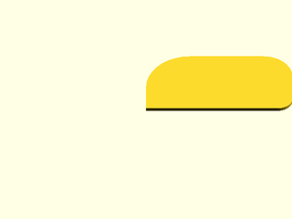
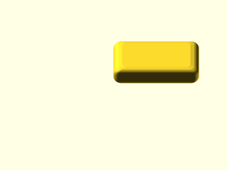
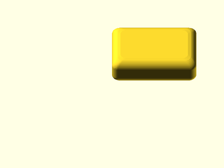
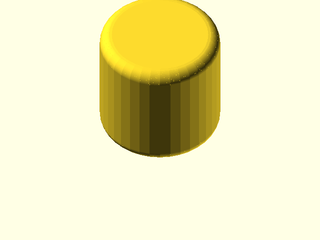
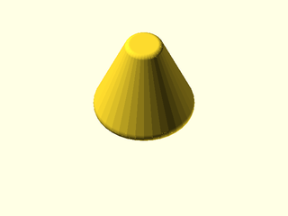
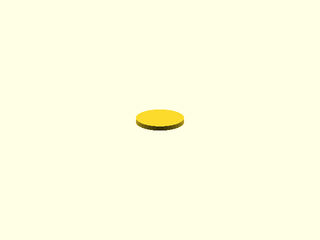
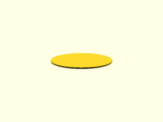
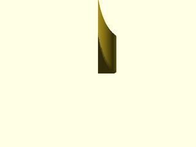
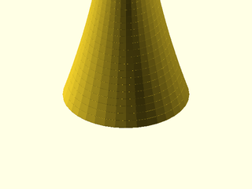
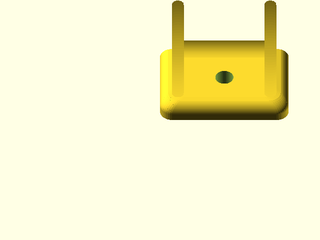

# LibFile: unfy\_brackets.scad

UnfyOpenSCADLib Copyright Leif Burrow 2026
kc8rwr@unfy.us
unforgettability.net

This file is part of UnfyOpenSCADLib.

unfy_shapes contains a collection of modules for generating geometric shapes with an emphasis on rounded corners and edges.

## File Contents

- [`unf_roundedRectangle`](#module-unf_roundedrectangle)
- [`unf_roundedCuboid`](#module-unf_roundedcuboid)
- [`unf_roundedCylinder`](#module-unf_roundedcylinder)
- [`unf_oval`](#module-unf_oval)
- [`unf_bezierWedge2d`](#module-unf_bezierwedge2d)
- [`unf_bezierWedge3d`](#module-unf_bezierwedge3d)
- [`unf_bezier_frustrum`](#module-unf_bezier_frustrum)
- [`unf_mount_tab`](#module-unf_mount_tab)

2. [Section: Licensing](#section-licensing)

### Module: unf\_roundedRectangle

**Usage:** 

- unf_roundedRectangle(<args>);

**Description:** 

Creates a 2d rectangle with rounded corners.

**Arguments:** 

<abbr title="These args can be used by position or by name.">By&nbsp;Position</abbr> | What it does
-------------------- | ------------
`size`               | may be a 2d vector [x, y] or a single number creating a square equivalent to [x, x] ([18, 5])
`corners`            | a vector containing the radiuses of each rounded corner (0 for no-rounding) [(0, 0), (x, 0), (x, y), (0, y)] or a single number to make all corners the same ([1, 1, 1, 1])

**Figure 1.1.1:** defaults

  

**Figure 1.1.2:** custom

  

---

### Module: unf\_roundedCuboid

**Usage:** 

- unf_roundedCuboid(<args>);

**Description:** 

Creates a 3d cuboid with rounded corners.

**Arguments:** 

<abbr title="These args can be used by position or by name.">By&nbsp;Position</abbr> | What it does
-------------------- | ------------
`size`               | may be a 3d vector [x, y, z] or a single number creating a cube equivalent to [x, x, x] ([20, 10, 5])
`corners`            | a vector containing the radiuses of each rounded corner ordered [[0,0], [x,0], [x,y], [0,y]] or a single number making all corners the same ([1, 1, 1, 1])
`edge_r`             | an 8-dimensional vector containing the radiuses of each rounded edge [FT, RT, BT, LT, FB, RB, BB, LB], or 4-dim [F, R, B, L], 2-dim [T, B], or single number ([1, 2, 1, 2, 1, 2, 1, 2])

**Figure 1.2.1:** defaults

  

**Figure 1.2.2:** custom

  

---

### Module: unf\_roundedCylinder

**Usage:** 

- unf_roundedCylinder(<args>);

**Description:** 

Creates a cylinder with rounded top and/or bottom edges.

**Arguments:** 

<abbr title="These args can be used by position or by name.">By&nbsp;Position</abbr> | What it does
-------------------- | ------------
`r`                  | radius of cylinder (0)
`d`                  | diameter of cylinder (0)
`r1`                 | bottom radius (0)
`r2`                 | top radius (0)
`d1`                 | bottom diameter (0)
`d2`                 | top diameter (0)
`h`                  | height of cylinder (1)
`edge_r`             | general edge radius for both ends (0)
`edge1_r`            | bottom edge radius (0)
`edge2_r`            | top edge radius (0)

**Figure 1.3.1:** defaults

  

**Figure 1.3.2:** custom

  

---

### Module: unf\_oval

**Usage:** 

- unf_oval(<args>);

**Description:** 

Draw an oval by size.

**Arguments:** 

<abbr title="These args can be used by position or by name.">By&nbsp;Position</abbr> | What it does
-------------------- | ------------
`size`               | 2d vector [x, y] for oval dimensions ([8, 4])

**Figure 1.4.1:** defaults

  

**Figure 1.4.2:** custom

  

---

### Module: unf\_bezierWedge2d

**Usage:** 

- unf_bezierWedge2d(<args>);

**Description:** 

Sort of a right-triangle but the hypotenuse is a bezier curve pulled in rather than a straight line. Good for inside-corners.

**Arguments:** 

<abbr title="These args can be used by position or by name.">By&nbsp;Position</abbr> | What it does
-------------------- | ------------
`size`               | a 2d vector [x, y] or a single number ([5, 15])
`v`                  | a vector to affect the shape of the bezier curve (false)

**Figure 1.5.1:** defaults

  

**Figure 1.5.2:** custom

  

---

### Module: unf\_bezierWedge3d

**Usage:** 

- unf_bezierWedge3d(<args>);

**Description:** 

A 3-dimensional wedge shape, fits inside a right-angle with a bezier curve along the hypotenuse.

**Arguments:** 

<abbr title="These args can be used by position or by name.">By&nbsp;Position</abbr> | What it does
-------------------- | ------------
`size`               | a 3d vector [x, y, z] or a single number ([5, 15, 15])
`rounded_edges`      | vector or number for edge rounding ([1, 1])

**Figure 1.6.1:** defaults

  

**Figure 1.6.2:** custom

  

---

### Module: unf\_bezier\_frustrum

**Usage:** 

- unf_bezier_frustrum(<args>);

**Description:** 

Creates a 3D frustum shaped object transitioning via bezier curves with optional edge rounding.

**Arguments:** 

<abbr title="These args can be used by position or by name.">By&nbsp;Position</abbr> | What it does
-------------------- | ------------
`base_d`             | uniform base diameter (0)
`base_dx`            | base x dimension (80)
`base_dy`            | base y dimension (60)
`base_edge_r`        | base edge rounding radius (0)
`end_d`              | uniform end diameter (0)
`end_dx`             | end x dimension (20)
`end_dy`             | end y dimension (40)
`end_edge_r`         | end edge rounding radius (0)
`control_height_pct` | height percentage for bezier control point (50)
`control_pinch_pct`  | pinch percentage for bezier control point (50)
`length`             | total length along z axis (300)

**Figure 1.7.1:** defaults

 

---

### Module: unf\_mount\_tab

**Usage:** 

- unf_mount_tab(<args>);

**Description:** 

Creates a mounting tab with an integrated bolt hole, washer recess, and reinforcing web supports.

**Arguments:** 

<abbr title="These args can be used by position or by name.">By&nbsp;Position</abbr> | What it does
-------------------- | ------------
`tab_length`         | length dimension of the mounting tab
`tab_height`         | thickness/height of the tab
`bolt_d`             | diameter of the bolt hole
`washer_v`           | washer definition vector for the recess
`wall`               | wall thickness parameter

**Figure 1.8.1:** sample

 

---

## Section: Licensing

UnfyOpenSCADLib is free software: you can redistribute it and/or modify it under the terms of the
GNU General Public License as published by the Free Software Foundation, either version 3 of
the License, or (at your option) any later version.

UnfyOpenSCADLib is distributed in the hope that it will be useful, but WITHOUT ANY WARRANTY;
without even the implied warranty of MERCHANTABILITY or FITNESS FOR A PARTICULAR PURPOSE.
See the GNU General Public License for more details.

You should have received a copy of the GNU General Public License along with UnfyOpenSCADLib.
If not, see <https://www.gnu.org/licenses/>.

